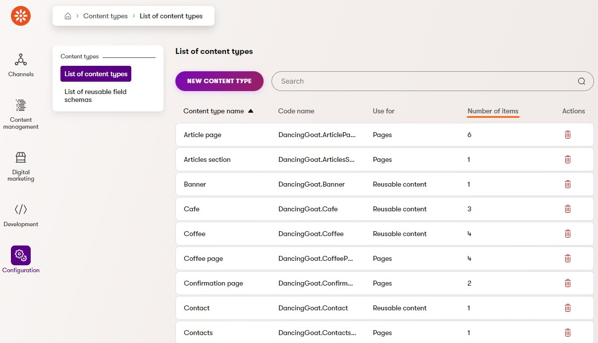

# Xperience Community: Page Extenders

## Description

Adds a `Number of items` column to the Content Type listing in the Xperience by Kentico administration interface to indicate the number of content items that exist for each content type.

## Screenshots

<a href="images/xperience-community-page-extenders-screenshot-content-type-listing.jpg">
  
</a>

## Library Version Matrix

| Xperience by Kentico version | Library version |
|------------------------------|-----------------|
| >= 29.5.2                    | 1.0.0           |

## Dependencies

- [ASP.NET Core 8.0](https://dotnet.microsoft.com/en-us/download)
- [Xperience by Kentico](https://docs.kentico.com/changelog)

## Package Installation

Simply add the package to your application using the .NET CLI

```powershell
dotnet add package XperienceCommunity.PageExtenders
```

## Contributing

Feel free to submit issues or pull requests to the repository, this is a community package and everyone is welcome to support.

## License

Distributed under the MIT License. See [`LICENSE.md`](LICENSE.md) for more information.